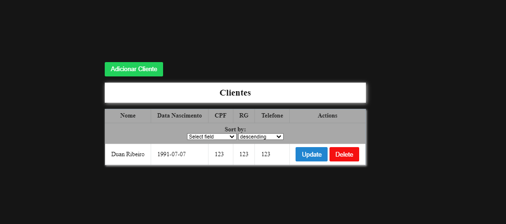

# Serasa Consumidor - Teste para Web Scrapping

## Proposta do exercício

* Criar uma área administrativa onde o(s) usuário(s) devem acessar através de login e senha.
* Criar um gerenciador de clientes (Listar, Incluir, Editar e Excluir)

## Requisitos
O código é desenvolvido utilizado a tecnologia de containers Docker.
Para rodar ele você irá precisar do [Docker](https://www.docker.com/products/docker-desktop/) e [Docker-Compose](https://docs.docker.com/compose/install/) instalados

## Iniciando a aplicação
    $ docker-compose up

## Testes
    $ docker exec django_api python backend/myapp/manage.py test clients login

## Arquivos
* `backend/*` - Pasta com toda implementação em Django da API.
* `backend/wait-for-it.sh` - Script para aguardar uma porta estar disponível.
* `backend/docker-entrypoint.sh` - Script para gerar as migrações e o usuário admin inicial.

* `frontend/*` - Pasta com toda implementação em React da UI.
* `frontend/src/components/*` - Pasta com componentes utilizados na UI.
* `frontend/src/router/*` - Rotas da UI.

